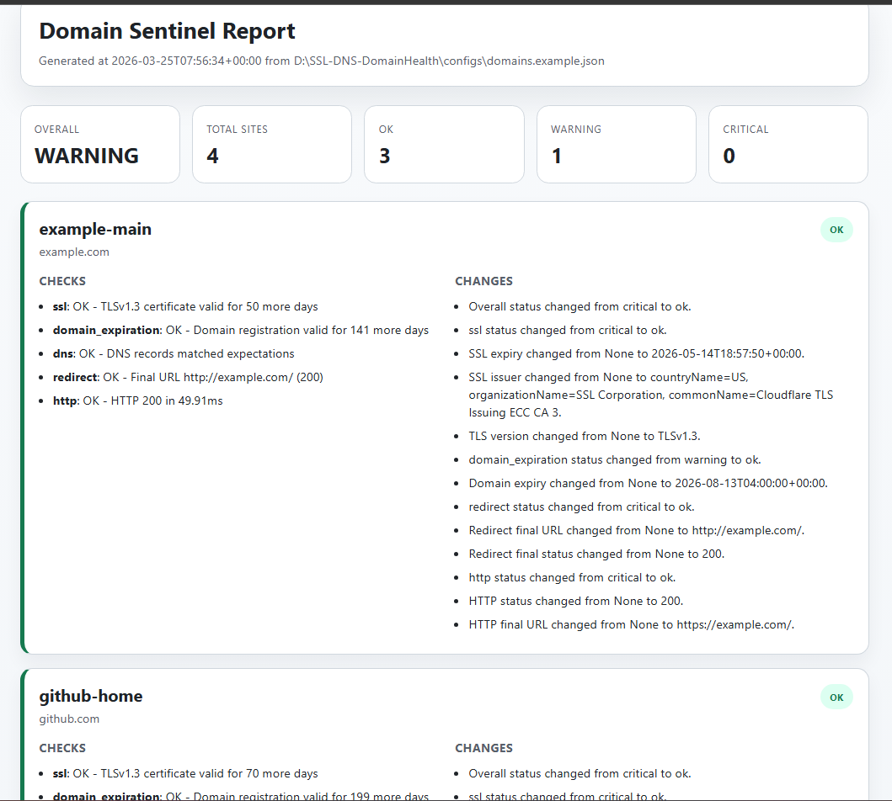

# Domain Sentinel

Domain Sentinel is a small multi-site SSL, DNS, redirect, endpoint, and domain health manager built as a portfolio-ready ops utility.

## Report Preview

The generated HTML report gives a quick view of overall status, per-site checks, and detected changes.



## What it does

- checks SSL certificate expiry and basic TLS details
- flags hostname mismatch, self-signed certificates, and legacy TLS versions
- checks domain registration expiry with a best-effort RDAP lookup
- checks DNS records against expected values or basic resolvability
- checks redirect behavior and loop risk
- checks HTTP endpoint status, content, and latency threshold
- checks common security headers such as HSTS, CSP, X-Frame-Options, and X-Content-Type-Options
- stores a snapshot from each run
- compares the latest run against the previous run
- exports JSON, CSV, and HTML reports
- ships with a Dockerfile and GitHub Actions CI workflow

## Why It Matters

A domain is not just a single web page. A healthy public-facing service depends on multiple layers working together:

- DNS has to resolve to the correct target
- TLS/SSL has to be valid and trustworthy
- the domain registration itself must not be close to expiration
- redirects have to lead to the correct destination
- the HTTP endpoint has to respond with the expected result
- basic browser-facing security headers should still be present

Domain Sentinel treats those layers as one health surface instead of checking only uptime.

## How It Works

### SSL / TLS

The SSL check validates the security layer of the service. It inspects certificate validity, days until expiry, the negotiated TLS version, hostname matching, and basic certificate trust signals such as self-signed detection. This matters because a website can still be online while being close to certificate expiration or using a weak or mismatched TLS setup.

### Domain Registration Expiry

The domain expiration check validates the registration lifecycle of the base domain. It uses a best-effort RDAP lookup and reports how many days remain before the domain registration expires. This matters because a site can have a valid certificate and healthy endpoint while the domain itself is still at renewal risk.

### DNS

The DNS check validates the routing layer of the domain. It confirms that the domain resolves and, when expectations are configured, that the resolved records match the intended state. This matters because a service may fail even when the application itself is healthy if DNS points to the wrong place.

### Redirects

The redirect check validates URL flow correctness. It follows the redirect chain, detects loops, and reports the final destination. This matters because many production sites rely on predictable redirects such as `http -> https` or `apex -> www`.

### HTTP

The HTTP check validates application-level availability. It checks whether an endpoint responds, returns the expected status code, contains expected content, and stays within an acceptable latency threshold. This is the closest layer to what a real user or client actually experiences.

### Security Headers

The security headers check validates a small but useful slice of browser-facing hardening. It inspects whether the final response includes common headers such as `Strict-Transport-Security`, `Content-Security-Policy`, `X-Frame-Options`, and `X-Content-Type-Options`. This matters because a site can be available while still missing basic protection signals.

### Snapshot Diffing

A one-time check only describes the current state. Domain Sentinel also stores snapshots and compares the current run with the previous one. This turns the tool from a simple checker into a small monitoring utility that can answer not only "what is wrong now" but also "what changed since the last run".

### JSON / CSV / HTML Reporting

The reporting layer makes the results reusable. JSON is intended for automation and downstream processing, CSV is intended for quick inspection and lightweight reporting, and HTML provides a shareable visual summary of overall status, per-site checks, and detected changes.

## Stack

- Python 3.12
- standard library only for the runtime MVP
- optional YAML support when `PyYAML` is installed
- Dockerfile for containerized execution
- GitHub Actions workflow for lint, test, compile, and build checks

## Quick Start

Run from the repository root:

```powershell
py main.py run -c configs/domains.example.json --pretty-summary
```

On systems where `python` is the active launcher:

```powershell
python main.py run -c configs/domains.example.json --pretty-summary
```

Open the generated HTML report:

```powershell
start artifacts\latest.html
```

If you want an installed CLI command:

```powershell
python -m pip install -e .
domain-sentinel run -c configs/domains.example.json --pretty-summary
```

If you want YAML config support:

```powershell
python -m pip install PyYAML
py main.py run -c configs/domains.example.yaml --pretty-summary
```

## Docker

Build the image:

```powershell
docker build -t domain-sentinel .
```

Run the default sample config in a container:

```powershell
docker run --rm domain-sentinel
```

Persist generated reports to the local `artifacts` folder:

```powershell
docker run --rm -v "${PWD}\artifacts:/app/artifacts" domain-sentinel
```

## Config Example

JSON works out of the box:

```json
{
  "version": 1,
  "defaults": {
    "timeout_seconds": 8,
    "ssl_warning_days": 21,
    "ssl_critical_days": 7,
    "domain_warning_days": 45,
    "domain_critical_days": 14,
    "max_redirect_hops": 5
  },
  "sites": [
    {
      "id": "company-main",
      "domain": "www.example.com",
      "registered_domain": "example.com",
      "url": "https://www.example.com/",
      "checks": [
        "ssl",
        "domain_expiration",
        "dns",
        "redirect",
        "http",
        "security_headers"
      ],
      "expect": {
        "status_code": 200,
        "body_contains": "Example Domain",
        "max_response_ms": 1500,
        "security_headers": {
          "required": [
            "Strict-Transport-Security",
            "Content-Security-Policy",
            "X-Frame-Options",
            "X-Content-Type-Options"
          ]
        }
      }
    }
  ]
}
```

Supported checks:

- `ssl`
- `domain_expiration`
- `dns`
- `redirect`
- `http`
- `security_headers`

Supported expectations:

- `status_code`
- `body_contains`
- `body_not_contains`
- `max_response_ms`
- `final_url`
- `domain_warning_days`
- `domain_critical_days`
- `security_headers.required`
- `dns.A`, `dns.AAAA`, `dns.CNAME`, `dns.MX`, `dns.NS`, `dns.TXT`
- `dns.TXT_CONTAINS`

Supported site fields:

- `id`
- `domain`
- `registered_domain`
- `url`
- `redirect_url`
- `checks`
- `tags`
- `enabled`

## Output

Each run writes:

- `artifacts/latest.json`
- `artifacts/latest.csv`
- `artifacts/latest.html`
- `artifacts/runs/<timestamp>.json`

Exit codes:

- `0` = all OK
- `1` = warnings found
- `2` = critical issues found
- `3` = config or runtime error

## CI

The repository includes a GitHub Actions workflow at `.github/workflows/ci.yml` that runs:

- `ruff check .`
- `python -m unittest discover -s tests -v`
- `python -m compileall src main.py`
- `python -m build`

## Tests

```powershell
py -m unittest discover -s tests -v
```

## Notes

- YAML is optional because the runtime MVP avoids mandatory external dependencies.
- Domain expiry uses a best-effort RDAP lookup, so availability can vary by registry or rate limit.
- DNS is resolved with built-in socket calls for A/AAAA and system resolver commands for other record types.
- Some public websites intentionally block simple scripted requests, which can surface as `403` or block pages instead of `200`.
- This is an MVP intended for GitHub and further extension, not a hardened production monitor yet.
